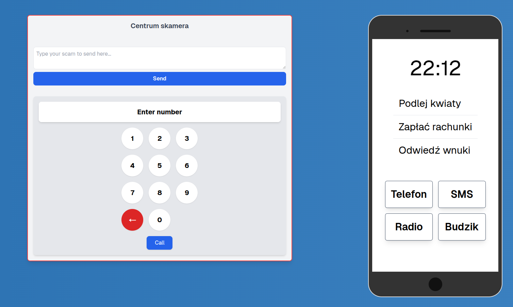
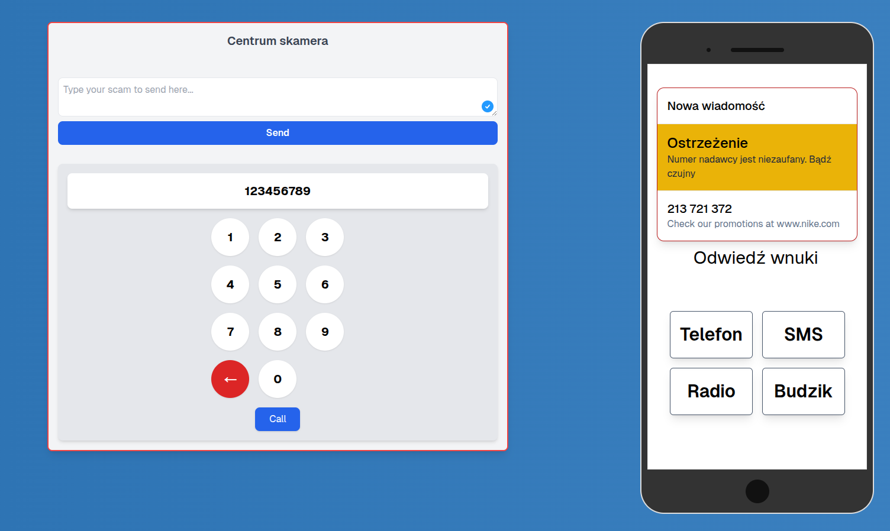
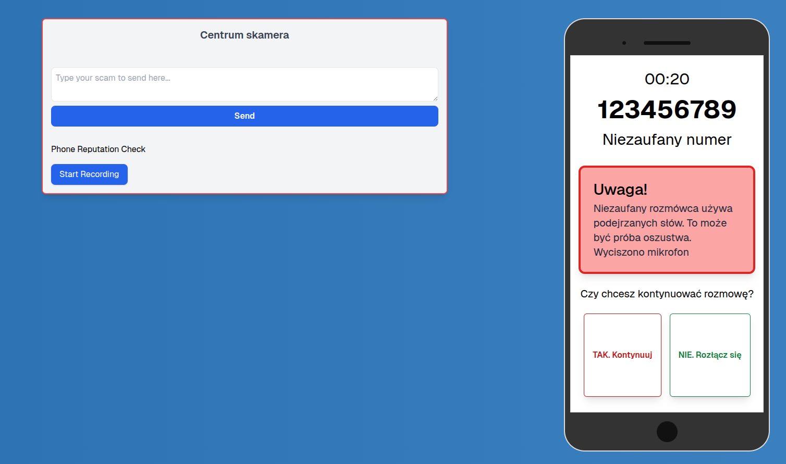

# wnucheck-mvp

WnuCheck is an MVP application designed to help protect individuals, especially seniors, from fraud attempts. It leverages advanced AI models to evaluate whether a given conversation or SMS is fraudulent, providing a layer of protection against scams.

**Main app view:**


**Fraud detection for messages:**


**Phone call fraud detection:**



## Frontend Setup

To run the frontend, refer to the `README` in the `frontend/` directory.

## Backend Functionalities

The backend of WnuCheck offers the following core functionalities:

- **Fraud Detection for Conversations**: The backend evaluates audio recordings to determine if they contain fraudulent elements.
- **SMS Fraud Detection**: Text messages are analyzed to identify potential scams or phishing attempts.

### Backend Modes

The backend can operate in two distinct modes, configurable via the `.env` file:

1. **Local Inference Mode**:
   - Uses an open-source model for fraud detection, running locally on your machine.
   - Supports GPU acceleration for faster inference if a compatible GPU is available and configured.

2. **API-based Mode**:
   - Leverages external API calls (OpenAI) for fraud detection.
   - Requires an API key, which should be provided in the `.env` file as `OPENAI_API_KEY`.

## Backend Setup

Backend tested with Python 3.9.6

### 1. Create a `.env` File

If you don't have it, copy the example `simple.env` file to a new file named `.env` (then fill with your own values):

```bash
cp simple.env .env
```

### 2. Set up a Virtual Environment

Create a new virtual environment:

```bash
python3 -m venv backend_venv
. backend_venv/bin/activate
pip install --upgrade pip setuptools
pip install -e .
```

### 3. Run the Project

To run the fastapi server, you can use the following command:

```bash
uvicorn backend.main:app --reload --port 8000
```

### 4. Access the API

The API is available at `http://127.0.0.1:8000` \
You can access the SwaggerUI at `http://127.0.0.1:8000/docs` (you can test the API here)

## Backend Testing

```bash
pytest
``` 

## Clear the project

To clear the project, you can delete the virtual environment and the `.env` file:

```bash
# /src/backend
deactivate
rm -rf backend_venv
rm -f .env
```
